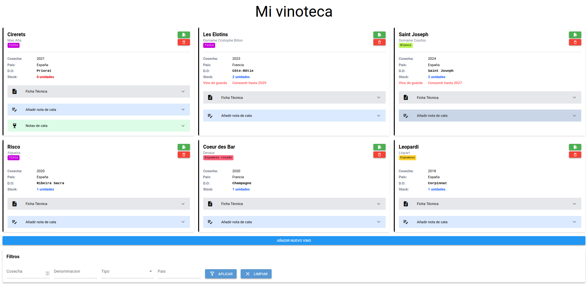
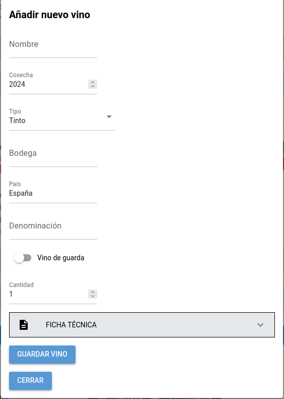

# Vinoteca
App para gestión de vinoteca doméstica

⚠️ Proyecto en desarrollo
***
## Características
- Gestión de vinos, fichas técnicas y notas de cata (alta, eliminación)
- Filtrado por tipo de vino, cosecha, pais o denominación
- Interfaz gráfica con NiceGUI
- Base de datos SQLite
***
## Capturas de pantalla
```text
docs/
├─ Pantalla_principal.png
└─ Diálogo_añadir_vino.png
```
---






## Tecnologías
- Python 3.12.3
- NiceGUI
- SQLite3
